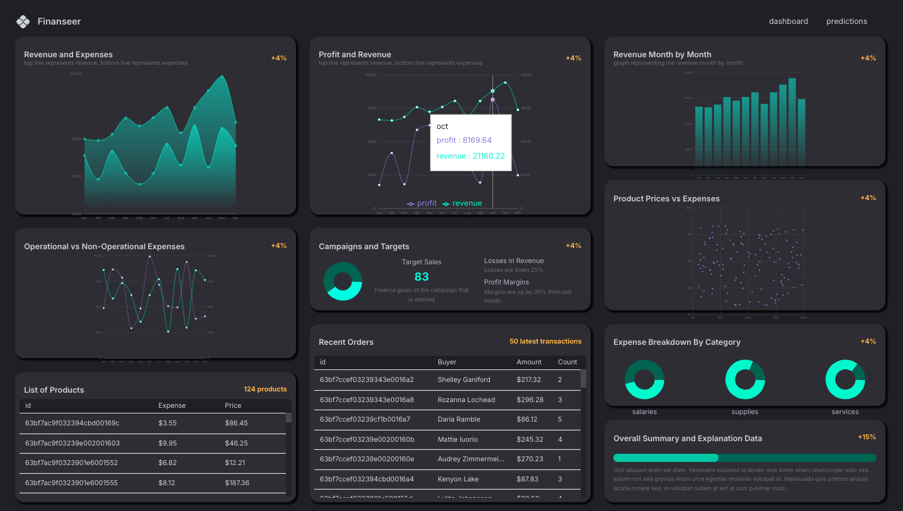
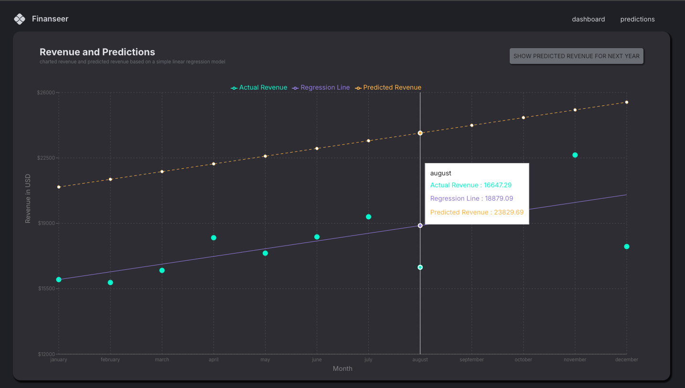

# Finaceer

A MERN (MongoDB, Express.js, React, Node.js) finance application featuring an interactive dashboard for tracking financial KPIs (Key Performance Indicators) and analytics. It includes interactive charts, product and order management, and revenue predictions powered by regression. Finaceer helps stakeholders make informed decisions with advanced data visualizations and forecasting.

### Tech Stack

#### Frontend

- React
- Redux - state management
- React Router
- RTK Query - API calls
- Recharts - chart library
- JavaScript
- TypeScript
- MaterialUIDataGrid - for tables

#### Backend

- Mongoose - database
- Node.js - runtime
- Express.js - backend framework
- Regression-js predictions for the model
- Lucidchart data modeling

### Website Features

- Interactive Dashboard
- Advanced Data Visualizations
- Revenue Predictions
- Real-Time API Data
- Deployment and Scalability
- Product and Order Management

# Dashboard Landing Page

# Revenue Projections Page

### Credit

Credit to EdRoh tutorial https://www.youtube.com/watch?v=uoJ0Tv-BFcQ&t=5099s
